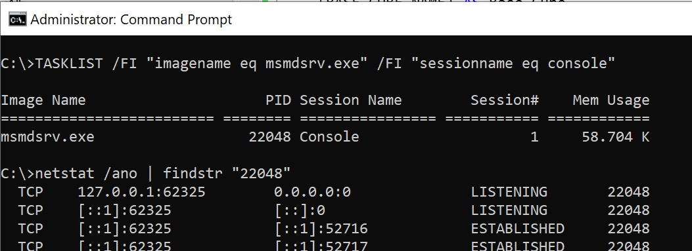
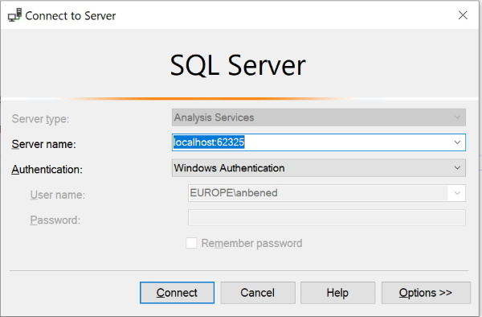
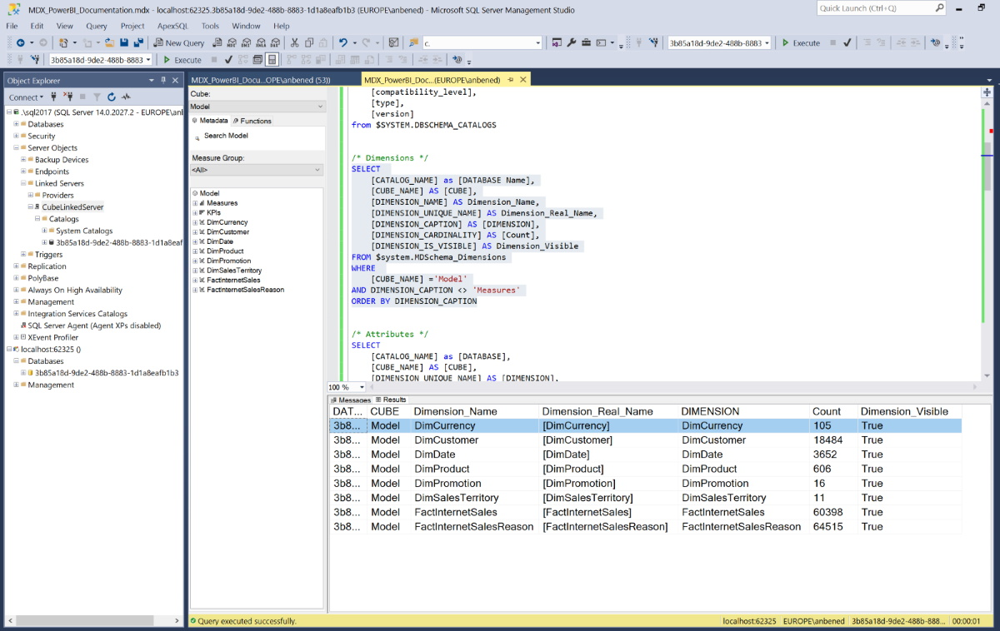
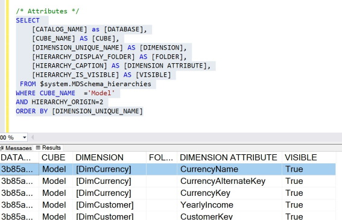
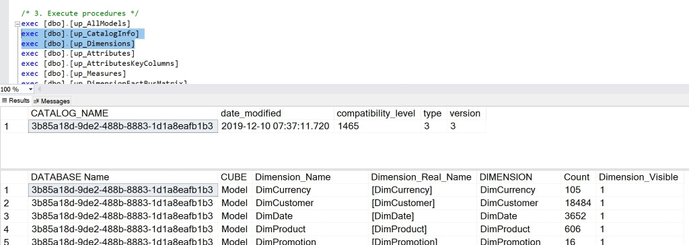

# How to document a Power BI (Desktop) Tabular Model

## With Power BI Desktop, we are able to create a robust, complex and rich data model and sometimes is quite handy to create simple documentation for the tabular database built with PBI: the catalog info, dimensions, attributes, measures, ...

There are some good tools out there but, the idea here is to create something using the SSAS Dynamic Management Views (DMV's), a very useful way to query metadata of a database. 

As you know, Power BI Desktop uses a kind of "personal" Analysis Services (it runs a local instance of SSAS Tabular model in the background), running on a random local port.

Please, pay attention that the port number used to connect to the local data model (AND the database name) will change every time you open the Power BI Desktop file, and the port number is crucial if you want to connect to a Power BI Desktop.

You can do that with different methods but those I prefer are:
- DAX Studio (https://daxstudio.org/)
- CMD shell

With the DAX Studio you need to open the tool, select the desired Power BI Desktop file and click "Connect".
Once connected, you can see the local port number in the button right of the DAX Studio window.


With che CMD shell, you need to run the tool as Administrator and run the following two commands.
The first is:
```
TASKLIST /FI "imagename eq msmdsrv.exe" /FI "sessionname eq console"
```
When you see the result, you need the PID and run the second command putting the Process ID number you got.
Something like:
```
netstat /ano | findstr "22048"
```
The results shows Active Connection, Local Address (followed by the port number), Foreign Address, State, PID. Something like:

| TCP | 127.0.0.1:62325 | 0.0.0.0:0 | LISTENING | 22048 |
...



The listening connection is the one we are interested in, and the number coming after the local address is the port number that we need

Now that we have the Analysis Services port, we are able to connect with SQL Server Management Studio (SSMS) on an Analysis Services server, something like: 



So, you can run some of the queries which I found very useful for this need. 



Talking about DMV's, useful links are available here:
- https://docs.microsoft.com/en-us/openspecs/sql_server_protocols/ms-ssas-t/f85cd3b9-690c-4bc7-a1f0-a854d7daecd8
- https://gist.github.com/mlongoria/a9a0bff0f51a5e9c200b9c8b378d79da 

As you can see, you can execute these queries from your SQL Server Management Studio (SSMS) using MDX or DMX query editor.


If you have a SQL Server engine in your dev machine, I also wrap up each query in a stored procedure with the SQL OPENROWSET command, executed against a SQL Server database with a linked server to the Power BI Desktop (your "personal" Analysis Services).

So, using this way, you're able to perform JOINs and all the TSQL constructs which you might need.

## Queries
- [MDX Queries](PBIDocumentation_MDX_Queries.sql)



- [SQL Server Procedures](PBIDocumentation_SQL_Procedures.sql)


